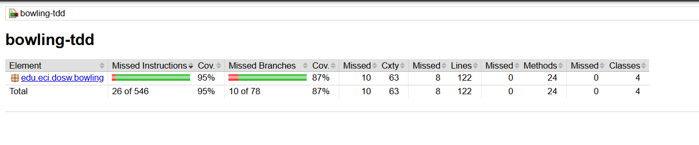

# Bowling TDD - Taller 02

## 1. Identificación

- **Nombre:** Julian Camilo Giral Cobos
- **Código estudiantil:** 1000100073
- **Correo institucional:** julian.giral-c@mail.escuelaing.edu.co
- **Curso:** DOSW - Desarrollo de Software
- **Proyecto:** Bowling TDD
- **Tecnología:** Java 24
- **Framework de pruebas:** JUnit 5.13.4

---

## 2. Descripción

BowlTech es un sistema para calcular el puntaje de una partida de Bowling.

El proyecto implementa las reglas principales del Bowling:

- Un lanzamiento normal suma los pinos derribados.
- Un Spare suma 10 puntos más el primer lanzamiento del siguiente frame.
- Un Strike suma 10 puntos más los dos siguientes lanzamientos.
- El décimo frame puede tener lanzamientos adicionales cuando existe un Strike o Spare.
- Un juego perfecto de 12 Strikes obtiene 300 puntos.

### Responsabilidades de las clases

**BowlingGame**

Se encarga de administrar el estado de la partida, registrar los lanzamientos, validar los pinos, controlar los frames y determinar cuándo termina el juego.

**Frame**

Representa un frame de Bowling y almacena sus lanzamientos. También determina si el frame corresponde a un lanzamiento normal, Spare o Strike.

**FrameType**

Es un `enum` que representa los tipos de frame utilizados por el sistema:

- NORMAL
- SPARE
- STRIKE
- TENTH

**BowlingScorer**

Se encarga de calcular el puntaje total a partir de los frames de la partida. Su responsabilidad está separada de la administración del juego.

---

## 3. Evidencia TDD

El desarrollo se realizó utilizando el ciclo:

**RED → GREEN → REFACTOR**

### RED

Primero se creó una prueba que representaba el comportamiento esperado y se ejecutó para comprobar que fallaba.

### GREEN

Después se implementó el código mínimo necesario para que la prueba pasara.

### REFACTOR

Finalmente se realizaron mejoras en la organización del código manteniendo el mismo comportamiento observable.

El historial de Git contiene los diferentes commits correspondientes a las fases del desarrollo TDD.

---

## 4. JaCoCo

Se configuró JaCoCo para medir la cobertura de las pruebas.

El reporte final obtuvo:

- **Cobertura de líneas:** 95%
- **Cobertura de ramas:** 87%
- **Pruebas ejecutadas:** 21
- **Pruebas exitosas:** 21

El proyecto cumple con el requisito mínimo de cobertura establecido para el taller.

### Evidencia final

El reporte HTML se encuentra generado en:

`target/site/jacoco/index.html`

La cobertura obtenida fue posible gracias a las pruebas de `BowlingGameTest` y `BowlingScorerTest`, incluyendo los casos de Spare, Strike, dos Strikes consecutivos, todos los Spares y juego perfecto.

## 7. Reflexión técnica

### 1. ¿Qué caso edge del Bowling fue el más difícil de implementar con TDD y por qué?

El caso más complejo fue el manejo del décimo frame, debido a que puede requerir lanzamientos adicionales cuando existe un Spare o un Strike. Esto hace que su comportamiento sea diferente al de los frames anteriores.

### 2. ¿Qué parte del código cambió durante REFACTOR sin modificar el comportamiento observable?

Durante REFACTOR se organizó la lógica de `BowlingGame`, separando responsabilidades en métodos auxiliares como la validación de los pinos, el registro del primer lanzamiento, el segundo lanzamiento y los lanzamientos adicionales del décimo frame.

El comportamiento observable del juego se mantuvo igual.

### 3. ¿Qué casos de prueba descubriste al revisar el reporte de cobertura de JaCoCo que no habían considerado antes?

El reporte permitió revisar las diferentes ramas de la lógica del juego, especialmente las relacionadas con la finalización del décimo frame y los lanzamientos adicionales.

En la versión actual se cuenta con pruebas para los casos principales de finalización, incluyendo un décimo frame con Spare, un décimo frame con Strike y un juego perfecto.
